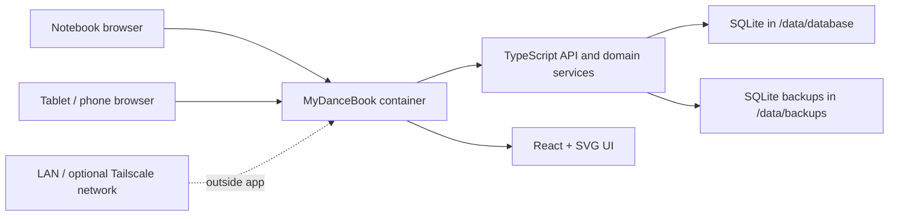
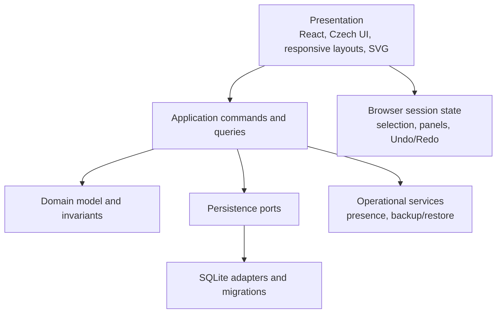

# Technical architecture

This document is authoritative for the intended Core-MVP runtime, logical boundaries, persistence, deployment, backup, autosave, and simultaneous-use behavior. It does not approve implementation yet and deliberately does not select a full-stack framework, API library, ORM, or test framework.

## Architectural drivers

- One pair should reach a usable textual dance notebook quickly.
- Real data starts in Core MVP, so migrations, transactions, backup, and restore are product features rather than cleanup work.
- Incomplete domain objects are normal and cannot be forced through rigid all-fields validation.
- Central FigureVariant edits must propagate by reference without copied routine data.
- Notebook, tablet, and phone use one responsive browser UI with an active backend connection.
- Future systems need clean boundaries, not premature persistence models.

## Approved technical direction

- one full-stack TypeScript codebase and deployable application;
- React + TypeScript browser frontend;
- TypeScript backend/API;
- SQLite as the live working database and Core-MVP source of truth;
- one Docker container for application deployment;
- a mounted `/data` root for persistent state;
- browser-native interactive SVG for the two-dimensional floor view.

“One application” means one deliverable and operational unit, not an undifferentiated codebase. Frontend, application/domain services, persistence, and infrastructure remain logically separated.

## System context



Tailscale supplies optional network reachability only. MyDanceBook does not call Tailscale APIs, authenticate through Tailscale, or configure it.

## Logical application boundaries



### Presentation

Owns Czech labels, responsive navigation, forms, scope visualization, incomplete/review state, SVG rendering, profile selection, and browser-session Undo history. It may use derived view models but cannot become the source of truth for persisted dance data.

### Application commands and queries

Expose task-level operations rather than raw table mutation. Important commands include:

- initialize Pair;
- create Figure with first variant;
- create Movement with first variant;
- create/reorder/link RoutineFigure;
- inline-create Figure and assign it;
- duplicate variant and switch occurrence;
- autosave a bounded edit;
- archive/restore a shared object;
- create backup and guarded restore.

Commands enforce cross-entity invariants transactionally. Queries produce views with canonical data, derived values, incompleteness, and consistency status clearly separated.

The concrete wire protocol (REST-style JSON, RPC-style HTTP, or a narrowly chosen framework convention) is an implementation decision. It must support typed contracts, stable error codes, rational values without float loss, and atomic task-level commands.

### Domain model

Owns invariants from [DATA_MODEL.md](DATA_MODEL.md), rational and frame semantics, archive rules, and non-blocking consistency checks. It must not depend on React, HTTP, Docker paths, or SQLite-specific row shapes.

### Persistence

Maps the relational core and typed extension records to SQLite, controls transactions and foreign keys, and runs versioned migrations. The browser never opens or modifies SQLite directly.

### Operational services

Presence, backup/restore coordination, health reporting, and maintenance state are application operations but not canonical dance entities. They must not leak future authentication or collaboration concepts into every domain record.

## Project structure direction

A future implementation should separate at least:

```text
application root
├── frontend/ or equivalent presentation boundary
├── server/ or equivalent API/runtime boundary
├── domain/ shared domain types and pure rules
├── persistence/ SQLite mappings and migrations
└── tests/ organized around the same boundaries
```

This is a responsibility map, not a required package/workspace layout. Phase 1 should choose the least complex TypeScript setup that preserves these import boundaries and one deployable product.

## SQLite strategy

SQLite is the live Core-MVP source of truth. Configure foreign-key enforcement and use transactions for aggregate changes. Stable relational structure covers identities, relationships, ordering, common searchable fields, timing uses, and Notes. Small typed extension values handle sparse evolving technique as described in [DATA_MODEL.md](DATA_MODEL.md).

Avoid:

- one JSON document for an entire FigureVariant or database;
- a table/column for every imaginable dance term;
- speculative pair/tenant/permission columns everywhere;
- duplicated canonical routine timing or transformed geometry;
- storage of operational UI state as dance data.

### Schema version and migrations

Maintain an explicit ordered migration history and a database schema-version record. Every application startup verifies that the database is compatible and runs only approved forward migrations under a transaction or the safest SQLite-supported migration sequence.

Migration policy:

1. create a pre-migration safety backup for changes with meaningful data risk;
2. preserve stable IDs and references;
3. transform unambiguous values deterministically;
4. retain ambiguous original information and mark it for review;
5. never silently discard or guess real dance data;
6. verify constraints and expected row/object counts before completion;
7. test migration from realistic previous fixtures, not only an empty database.

Rollback-by-down-migration is not assumed to be safer. Recovery can use the verified safety backup when a forward migration cannot complete.

### Typed extension storage

Before writing extension data, Phase 1 must define:

- owner/target identity;
- namespace and parameter key;
- schema version;
- supported scalar/reference/structured value types;
- units or vocabulary references where relevant;
- indexing and promotion rules.

Extension records remain small and locally owned. Promotion to common relational fields is a normal controlled migration.

## Autosave

Autosave sends bounded field/section commands, not full stale aggregate snapshots. Each command validates only what its operation needs and accepts incomplete surrounding objects.

The UI distinguishes:

- local edit pending;
- save in progress;
- persisted;
- connection/save failed;
- persisted but consistency review required.

Same-field simultaneous edits may use simple last-successful-write behavior in Core MVP. Presence reduces accidental overlap, but no semantic merge or optimistic-concurrency framework is promised. Failed writes must remain visible and retryable; the UI cannot display “saved” before the backend transaction succeeds.

## Simultaneous use and presence

Leader and Follower can connect at the same time. A lightweight ephemeral presence service tracks active profile, object/section being edited, and expiry heartbeat. It supports an informational warning and never hard-locks an object.

Presence data:

- is not durable dance data;
- can be lost on process restart without harm;
- is advisory and may be stale briefly;
- does not establish identity or permission.

Advanced object revisions, optimistic concurrency, semantic conflict resolution, and merge are future work. Core MVP should log and surface persistence errors so data loss is diagnosable.

## Session Undo/Redo

Undo/Redo lives in each browser session as a stack of successful user commands and inverse intent. An Undo issues a normal new backend command; it is not a database time machine and does not survive restart.

The stack should be cleared or conservatively limited when its assumptions become unsafe, such as after restore or large external refresh. It does not promise to undo another member's edits or resolve cross-user conflicts. Persistent conflict-aware Undo belongs to a later increment.

## Backup and restore

Backups use a supported SQLite online backup mechanism/API to create a transactionally consistent snapshot. A raw filesystem copy of an active database is forbidden.

Conceptual create-backup flow:

1. request backend backup operation;
2. use SQLite's supported snapshot/backup facility while normal consistency guarantees hold;
3. write to a temporary backup target under `/data/backups`;
4. verify the snapshot opens and passes basic integrity/schema checks;
5. atomically publish backup metadata/name;
6. report success only after verification.

Conceptual restore flow:

1. validate selected backup metadata and compatibility;
2. show warning and require explicit user confirmation;
3. enter short maintenance mode and reject new edits;
4. create and verify a safety backup of current state;
5. restore using a supported SQLite-safe process;
6. reopen and integrity-check the database;
7. run only compatible required migrations;
8. leave maintenance mode and force clients to reload canonical state.

On failure, retain or recover the pre-restore current state and present a clear error. Restore is serialized with migrations and other maintenance operations.

## Docker data layout

The container uses one stable mounted root:

```text
/data/
├── database/      # active SQLite database and SQLite-managed companion files
├── backups/       # verified database snapshots and metadata
├── attachments/   # reserved for later source/document capability
└── repository/    # reserved for later Git/export capability
```

Core MVP actively needs `database/` and `backups/`. Empty future directories may be created by deployment only when useful, but their presence must not imply implemented attachment or Git features.

The host/NAS supplies `/data` through a Docker volume or bind mount. Application UX does not browse arbitrary host filesystem paths from inside the container. Startup verifies writable directories and fails clearly rather than silently using ephemeral container storage.

## SVG and responsive frontend

SVG derives its rendered model from canonical SU geometry, optional scale, Routine placement, and Floor dimensions. It does not write transformed Floor-coordinate copies back to FigureVariant. Marker semantics are defined in [TIMING_AND_GEOMETRY.md](TIMING_AND_GEOMETRY.md).

React presentation uses one route/state model across notebook, tablet, and phone. Complex controls can reflow to full-screen mobile editors without creating a separate API or data model. Accessibility alternatives exist for drag, color, and SVG-only information.

## Trust and security boundary

Core MVP assumes deployment on a network controlled by the pair. There is no login. Leader/Follower/Host selection is a UI context and must never be advertised as authorization.

The backend must still follow ordinary safety basics: validate inputs, avoid arbitrary path access, constrain backup names/locations, protect against malformed requests, and avoid exposing SQLite internals. Real remote guest security requires future authentication/permissions and is explicitly not achieved by Host mode.

## Testing obligations when implementation starts

No test framework is selected yet, but implementation requires:

- pure domain tests for central-reference, ordering, discipline, rational-time, and state-provenance invariants;
- migration tests with non-empty fixtures and ambiguous data cases;
- persistence transaction/foreign-key tests;
- API contract tests for atomic compound commands;
- backup consistency, restore safety-backup, and failure-recovery tests;
- autosave and simultaneous-use risk tests;
- responsive end-to-end tests for the notebook and key phone flows;
- deterministic SVG model tests plus focused visual/accessibility checks.

## Future system boundaries

Core code should expose narrow seams, not implement future subsystems:

- export/versioning reads stable domain snapshots through an application query later;
- sources/rules attach through SourceReference migration rather than polluting current technique records;
- authentication/multiple pairs can add principal/ownership roots through controlled migration;
- RoutineAdaptation becomes a separate derived/override aggregate rather than changing Core RoutineFigure;
- advanced geometry adds segment types/renderers without redefining SU/FigureFrame;
- 3D adds body models and transforms without making the 2D semantic layers obsolete.

## Decisions deferred to Phase 1

Focused ADRs are required for:

- TypeScript runtime/build layout and full-stack framework, if any;
- API transport/style and shared type-validation strategy;
- SQLite driver and migration mechanism;
- ORM/query builder/raw SQL choice;
- test tools;
- Note attachment physical mapping;
- rational, order-key, and typed-extension SQL encoding;
- arc/loop segment parameterization.

Selection criteria are data safety, migration transparency, type correctness, low operational complexity, and speed to the Phase-2 textual notebook—not future-platform feature count.
