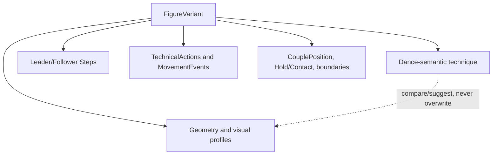

# Dance technique model

This document explains how competition Standard and Latin information maps into the common MyDanceBook model. It is a representation model, not an official technique source. It deliberately makes no claim that every dance uses every concept or that any illustrative value is technically correct.

Entity ownership is defined in [DATA_MODEL.md](DATA_MODEL.md). Exact timing and frames are defined in [TIMING_AND_GEOMETRY.md](TIMING_AND_GEOMETRY.md).

## One common core, several independent layers

Standard and Latin share the same entities and timeline. Discipline templates change which sections the UI emphasizes and in what order; they are not validation rules and do not create separate databases.

The layers can refer to the same rational time but retain different meaning and provenance:

- dance-semantic technique: Alignment/Direction, Rise & Fall, Sway, Hip/Body Action, CBM/CBMP, footwork and other theory terms;
- event/action structure: Steps, TechnicalActions, and MovementEvents;
- semantic relationship state: CouplePosition and Hold/Contact;
- geometry: trajectories, DancerFrame/body-part orientations, CoupleRotation, and inclination;
- visual abstraction: VerticalProfile;
- boundary summary: incomplete EntryState and ExitState snapshots.

No layer silently overwrites another. A future suggestion engine may propose a relationship and require user confirmation.

## Structured common technique

Frequently entered values need first-class UI and typed representation. The user should enter a compact row such as “RF / forward / HT / 1⁄4 turn” rather than assemble arbitrary keys.

Common Step fields include:

- moving foot and supporting foot as vocabulary-backed values;
- semantic direction and foot placement;
- footwork/contact progression;
- weight transfer type/amount;
- turn amount as a typed signed/rational-turn value plus semantics when needed;
- Alignment/Direction;
- optional timeline start and duration;
- selected stable discipline markers such as CBM/CBMP applicability where the schema/API decision confirms their best shape.

TechnicalAction gives Step-bound action type, target, time, parameters, and source a stable structure. Common action types remain queryable vocabulary/fields rather than Note prose.

Typed extension parameters are appropriate for rare or evolving details, but each has a small owner, namespace, value type/unit, and schema version. Repeated properties graduate to common fields through migration. Notes explain context; they are not a dumping ground for routine structured technique.

## Step, TechnicalAction, or MovementEvent?

| Question | Model | Example category |
| --- | --- | --- |
| Is it the dancer's numbered foot action? | `Step` | moving/supporting foot, placement, footwork, amount of turn |
| Is it technique tied directly to one concrete Step? | `TechnicalAction` | weight transfer action, supporting-foot rotation, foot pressure |
| Is it independent body movement, held state, or movement spanning Steps? | `MovementEvent` referencing `MovementVariant` | arm action, head action, torso action, Hip/Body Action sequence |

A Step is never reduced to MovementEvent. A MovementEvent may overlap Steps from either dancer. TechnicalAction's required Step reference keeps Step-specific information discoverable.

Leader and Follower Step counts do not need to match. Each dancer has an independent displayed order, while any known start and duration still use the shared Figure timeline.

## Targeting and BodyPart

A technical record can target the whole couple, Leader, Follower, or a concrete member plus BodyPart. For example, a MovementEvent can target `FOLLOWER + LeftArm`; a couple-level Rise & Fall description can target `COUPLE`; a Hip/Body Action can target `LEADER + Hips`.

The predefined BodyPart hierarchy supports useful entry immediately and can be extended without a schema migration. It does not include physical dimensions in Core MVP.

## Standard UI template

The Standard template should naturally surface, without requiring all fields:

1. timing;
2. Leader and Follower Steps/feet;
3. foot placement, footwork, load and weight transfer;
4. turn amount and Alignment/Line of Dance semantics;
5. CBM/CBMP and other Step/technical markers;
6. CouplePosition;
7. Hold/Contact;
8. Rise & Fall;
9. Sway and separate inclination;
10. body/chest, head, and arms;
11. EntryState/ExitState and trajectories;
12. Notes and sources.

This order is a default. A pair can hide/reorder predefined sections. It does not assert that Tango, Waltz, or any other Standard dance uses every item in the same way.

## Latin UI template

The Latin template should naturally surface:

1. timing/rhythm;
2. Leader and Follower Steps/feet;
3. placement, footwork, load and weight transfer;
4. turn amount;
5. CouplePosition;
6. Hold/Contact;
7. Hip Action and Body Action;
8. body/chest, head, arms and styling;
9. EntryState/ExitState and trajectories;
10. Notes and sources.

Again, the template is convenience, not a rule that every Latin dance needs each field or action.

## Important semantic distinctions

### Alignment/Direction versus absolute angle

Alignment/Direction stores dance-language semantics relative to concepts such as Line of Dance, Against Line of Dance, Wall, Centre, Diagonal Wall, or Diagonal Centre, plus Facing, Backing, or Pointing as applicable.

An exact orientation angle belongs to geometry in a declared frame. A mapping between them can be suggested or checked only when enough Floor/routine context exists. Neither value is automatically rewritten to match the other.

### CouplePosition versus Hold/Contact

CouplePosition describes the semantic relationship/configuration of the two dancers. Hold/Contact describes connection/contact endpoints or absence of hold. Both are timed extensible state layers because either can change while the other stays constant.

The initial vocabulary can include familiar names as user-facing examples but cannot hardcode one table type per position or hold.

### Rise & Fall versus VerticalProfile

Rise & Fall is semantic technique stored as structured timed terms/actions. VerticalProfile is a dimensionless continuous visual curve. They can be viewed together and compared, but neither is derived canonically from the other, and Core MVP does not infer Rise & Fall from knee/foot geometry.

### Sway versus geometric inclination

Sway is a semantic technical event/state. Inclination is geometric orientation of a dancer or BodyPart in an identified frame. Their time intervals may correspond, but equality is not assumed.

### Hip/Body Action versus geometry

Hip Action and Body Action are semantic structured action types and/or MovementEvents. Pelvis/chest rotations and offsets are separate geometry. Recording one never fabricates the other.

### CoupleCenter, CoupleRotation, and body direction

CoupleCenter is a choreographic translation reference; CoupleRotation is independent rotation around it; DancerFrame expresses each dancer's chest/body orientation. Path tangent does not determine chest orientation, and chest orientation does not determine head/gaze.

## EntryState and ExitState

Boundary snapshots make synchronization and routine connection review practical without duplicating the whole FigureVariant. Each component is optional and may include:

- Leader and Follower relation/orientation;
- CouplePosition and Hold/Contact;
- left/right FootState and weight distribution;
- selected Alignment/body state;
- timing phase/constraint.

Detailed Steps, events, and trajectories may derive candidate boundary values. Manually entered snapshots remain canonical. Clear disagreement is `REQUIRES_REVIEW`; insufficient data is `CANNOT_YET_VERIFY`.

Core MVP does not need a FigureConnection rule engine and never blocks a routine solely because a boundary is incomplete.

## Representability test A: fictional Standard variant

The following is a storage-fit test only. “Standard test figure S” and every listed value are invented for software verification; they are not instruction for Waltz or any other dance.

Assume a Figure in Waltz with a FigureVariant named “Fictional S variant.” Its model can contain:

| Requested dimension | Fictional example | Structured location |
| --- | --- | --- |
| Independent Steps | Leader L1/L2 and Follower F1/F2/F3 | Five `Step` rows, separately ordered by subject |
| Timing | L1 starts `0/1`, F1 starts `1/4`; fictional full-bar Pattern is clipped at final use | Common rational timeline plus `TimingPatternUse` |
| Moving/supporting foot | L1 uses `RF` and supporting `LF` | Vocabulary-backed Step fields |
| Footwork | L1 value `HT` | Structured Step footwork/contact value |
| Weight transfer | L1 `FULL_BY_END` with separate left/right FootState | Step field, TechnicalAction if action detail is needed, and FootStates |
| Amount of turn | L2 fictional `+1/8 turn` | Typed Step turn amount |
| Alignment/LOD | L1 fictional `FACING + DIAGONAL_WALL` | Semantic `AlignmentDirection`, not angle |
| CBM/CBMP | L1 fictional CBM marker; F2 fictional CBMP marker | Stable semantic marker/TechnicalAction referencing glossary concepts |
| Rise & Fall | Fictional “rise action” over `1/2..3/2` | `RiseFallEvent` targeting couple or member |
| Sway | Fictional “left sway” over `1/1..3/2` | `SwayEvent`; no angle implied |
| Geometric inclination | Fictional chest inclination sample `+3°` | Separate `GeometricInclination` with frame/provenance |
| CouplePosition | Fictional position term A then B | Timed `CouplePositionState` records |
| Hold/Contact | Fictional hold term H maintained across the change | Separate `HoldContactState` record |
| Body/head/arms | Fictional chest action and Follower head/arm actions | Reusable Movements and timed targeted `MovementEvent`s |
| Entry/Exit | Partial FootStates, semantic position/hold, Leader geometry and Follower relation | `EntryState` / `ExitState` components |
| Trajectories | Straight CoupleCenter, arc Leader, arc Follower | Three independent typed Trajectories in FigureFrame/SU |
| Couple rotation | Fictional `+1/8 turn` while translating | Independent timed `CoupleRotation` |
| Vertical movement | Fictional curve `0 → 1.2 → 0.2` | `VerticalProfile`, distinct from Rise & Fall |

Result: all required Standard dimensions have a structured owner. CBM/CBMP needs a concrete schema/API decision between a dedicated common marker and a stable TechnicalAction type, but it does not require free text or a new per-dance table. That decision is small and migration-safe.

## Representability test B: fictional Latin variant

“Latin test figure L” and every value below are equally fictional software fixtures, not Rumba, Samba, or other official technique.

Assume a Figure in Rumba with a FigureVariant named “Fictional L variant.” Its model can contain:

| Requested dimension | Fictional example | Structured location |
| --- | --- | --- |
| Independent Steps | Leader L1/L2/L3 and Follower F1/F2 | Separate `Step` orders on one timeline |
| Timing/rhythm | Pattern notation `Q & S` initially incomplete, later exact rational subdivisions | `TimingPattern` exactness state plus uses |
| Footwork | F1 fictional `B`, F2 fictional `BF` custom structured vocabulary | Step footwork/contact fields and GlossaryTerms |
| Weight transfer | L2 partial then full, with explicit bilateral load | Step/TechnicalAction plus left/right FootStates |
| Amount of turn | F2 fictional `-1/4 turn` | Typed Step turn amount |
| CouplePosition | Fictional semantic position C changes to D | Timed `CouplePositionState` |
| Hold/Contact | Fictional one-hand contact releases independently | Timed `HoldContactState` with endpoints |
| Hip Action | Fictional “hip action X” targeting Leader.Hips | Structured HipBodyAction/MovementEvent |
| Body Action | Fictional torso action spanning L1–L3 | MovementEvent targeting Leader.Torso |
| Body/head/arms | Follower chest direction geometry plus independent fictional head and arm Movements | DancerFrame/geometry and separate MovementEvents |
| Entry/Exit | Partial relative positions, both FootStates, position/hold and timing constraint | Boundary snapshots with entered/derived provenance |
| Trajectories | Loop CoupleCenter and independent dancer arcs | Typed local trajectories in SU |
| Geometric pelvis/chest data | Optional fictional rotations | Body-part geometry, separate from Hip/Body Action |

Result: the Latin dimensions also fit without Notes or a giant parameter blob. Specialized named Hip/Body actions can start as stable vocabulary-backed Movement variants and be promoted to richer common fields only after real data shows a stable need.

## Fit conclusion and gaps

The common model represents the requested Standard and Latin content cleanly while preserving independent dancer data, a shared timeline, and semantic/geometric separation. No product contradiction was found.

Two deliberate schema-level choices remain for implementation review:

1. choose the most ergonomic structured shape for common CBM/CBMP markers after testing the Step editor;
2. choose which Hip/Body action attributes deserve dedicated common fields versus typed MovementVariant parameters after entering representative real pair data.

Neither gap requires free-text fallback, blocks first capture, or justifies a separate Standard/Latin database. Both follow “create now, refine later” and can be promoted through data-preserving migration.
