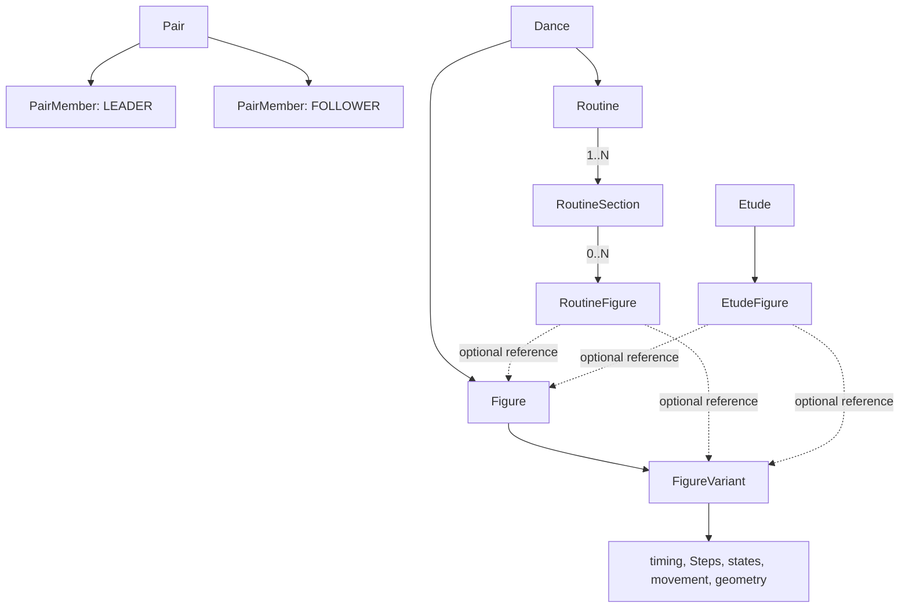
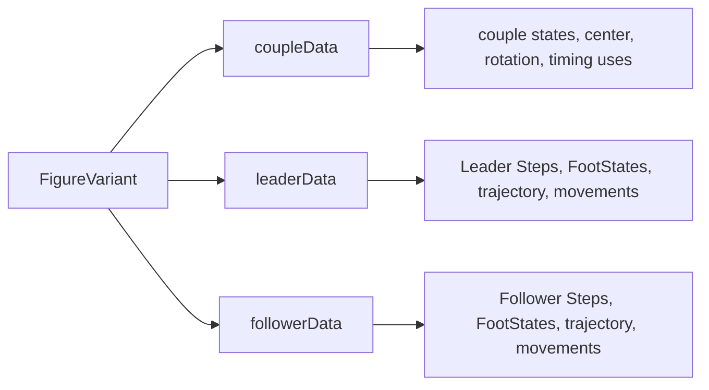
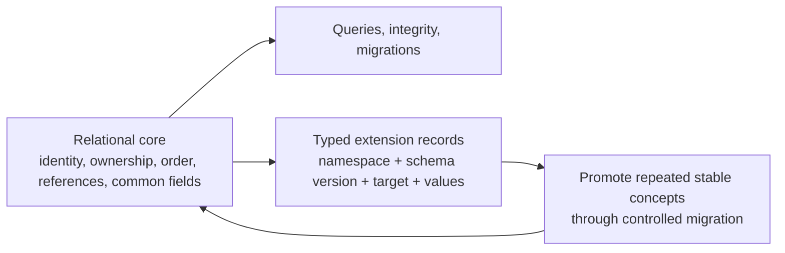

# Authoritative conceptual data model

This document defines Core-MVP domain identity, ownership, relationships, canonical versus derived data, and extension boundaries. It is conceptual rather than a frozen SQL schema. Exact timing and coordinate semantics are delegated to [TIMING_AND_GEOMETRY.md](TIMING_AND_GEOMETRY.md); technique interpretation is delegated to [DANCE_TECHNIQUE_MODEL.md](DANCE_TECHNIQUE_MODEL.md).

## Modeling rules

1. **Stable identity precedes completeness.** Persisted domain objects receive stable opaque IDs at creation and retain them while they are refined.
2. **Optional by default.** Only identity and the minimum creation fields listed here are required. A missing value is not the same as a zero, empty string, or negative assertion.
3. **One Pair is explicit, not repeated tenancy.** The database contains exactly one Pair aggregate in Core MVP. Do not add speculative tenant/owner columns to every table.
4. **Central definitions are referenced.** A RoutineFigure never contains a copied FigureVariant definition and has no generic technical override.
5. **Entered, derived, and operational data remain distinguishable.** Derived values never silently overwrite canonical entered values.
6. **Stable relationships are relational.** Evolving specialized technique may use typed extensible parameters, but not one giant document blob.
7. **Semantic dance theory and geometry are independent layers.** Cross-layer suggestions or checks do not make either layer a canonical replacement for the other.
8. **Archive shared referenced objects.** Existing references survive archiving; destructive deletion is reserved for safe, explicit cases.

Unless stated otherwise, persisted entities have `id`, `createdAt`, and `updatedAt`. Shared catalogue/knowledge entities also support `archivedAt` (nullable). IDs should not encode order, names, dance, or database row position.

## Kinds of state

| Kind | Examples | Persistence rule |
| --- | --- | --- |
| Entered canonical domain data | names, Note text, exact rational event time, selected variant, authored trajectory | SQLite source of truth |
| Entered semantic constraints | entryTimingConstraint, Alignment/Direction, manual EntryState | SQLite source of truth; never replaced by inference |
| Derived domain view | displayed step number, routine musical phase, transformed floor coordinates, derived boundary state | Recompute where practical; any cache is marked derived and disposable |
| Consistency result | `OK`, `REQUIRES_REVIEW`, `CANNOT_YET_VERIFY`, explanation | Recomputable; persisted only as an explicitly versioned cache if needed |
| Operational/session state | active profile, presence heartbeat, open panels, browser Undo stack | Browser memory or ephemeral server store; not canonical dance data |
| Configuration | technical-section order, default Floor, visualization colors | Persisted pair/Dance settings, not dance theory |

## Core identity and reference graph

The `Figure → FigureVariant → RoutineFigure reference` chain is the central invariant:

- `Figure` and `FigureVariant` are central reusable knowledge;
- `RoutineFigure` is one stable occurrence in a Routine;
- central edits are visible in every reference;
- occurrence-specific Notes and placement context stay on the RoutineFigure within its Section;
- a structurally different execution is another FigureVariant, not an override.

## Pair, profiles, and dance catalogue

### Pair

The one Core-MVP ownership root.

| Field | Requirement | Meaning |
| --- | --- | --- |
| `id` | required | Stable identity retained for future migrations |
| `defaultFloorId` | optional | Suggested Floor; never required by Routine |
| `leaderColor`, `followerColor` | optional | Visualization preferences with UI defaults |

Exactly one Pair exists after first run. Pair creation and its two PairMembers occur in one transaction.

### PairMember

| Field | Requirement | Meaning |
| --- | --- | --- |
| `pairId` | required | The one Pair |
| `role` | required | `LEADER` or `FOLLOWER`; unique within Pair |
| `displayName` | required | Entered on first run; editable |

Host is not a PairMember and is not persisted as an authenticated principal. `HOST` is a presentation-profile value in operational UI state. Note authors must be a real PairMember; Host cannot create Notes.

### Dance

A stable seeded catalogue entry with:

- `code` and internal English name;
- discipline `STANDARD` or `LATIN`;
- Czech display localization outside the domain identity;
- optional archived/availability metadata only if catalogue management is later needed.

The ten supported dances are seeded identities, not pair-created official figure data. Etude is not a Dance.

### DanceSettings

One optional settings record per Pair and Dance (or discipline-level defaults plus per-Dance overrides if implementation justifies it):

- visible and ordered predefined technical sections;
- optional `metersPerSU` calibration;
- optional VerticalProfile interpretation labels;
- display preferences and dance-specific default TimingScheme;
- no rule that every visible section must contain data.

These are pair UI/interpretation preferences, not official theory.

### Floor

| Field | Requirement | Meaning |
| --- | --- | --- |
| `name` | required | Pair-owned label |
| `widthMeters`, `lengthMeters` | required at creation | Positive rectangle dimensions in metres |
| `archivedAt` | optional | Removes Floor from new selection while preserving references |

Core MVP floors are concrete rectangles only; dimensionless Floor objects do not exist. Progressive capture is preserved because a Routine may refer to no Floor. A used Routine retains `nominalFloorId` plus a floor revision/reference fingerprint sufficient to warn when changed dimensions could invalidate a view. The exact revision mechanism is an implementation decision; a copy of all floor state is not a new independent Floor. See [ADR 0006](adr/0006-floor-creation-requires-dimensions.md).

## Figure knowledge

### Figure

| Field | Requirement | Meaning |
| --- | --- | --- |
| `danceId` | required | Part of figure identity |
| `nameCs` | optional | Czech official figure name |
| `nameEn` | optional | English official figure name |
| `aliases` | 0..N | Stable-id, shared informal or alternative identifiers |
| `archivedAt` | optional | Hidden from new selection, references remain valid |

Blank names normalize to absent. A Figure requires at least one identifier across `nameCs`, `nameEn`, or an alias; alias-only capture is intentional progressive capture. Aliases are shared central Figure knowledge (not RoutineFigure fields), preserve authored spelling, and are unique case-insensitively only within their Figure. Czech is the primary display name in the Czech UI and English is secondary when both exist; normal display falls back to the first alias. A transaction creating Figure also creates its first FigureVariant.

The user's selected Czech/English presentation is operational browser state, not Figure identity or shared Pair data. Normal display falls back to the available name when the preferred one is absent.

### FigureVariant

One reusable concrete execution by the whole couple.

| Field | Requirement | Meaning |
| --- | --- | --- |
| `figureId` | required | Parent Figure and therefore source Dance |
| `name` | generated/editable | Does not block first variant creation |
| `timingNotation` | optional | Human-authored readable shorthand, not canonical exact timing |
| `timingSchemeId` | optional | The single unit/context for every exact timeline value in this variant |
| `duration` | optional RationalTime | Exact relative duration in the selected Scheme's beat units |
| `entryTimingConstraint` | optional | The sole editable musical-entry constraint; present only with and interpreted in the selected Scheme |
| `archivedAt` | optional | Existing references remain valid |

The aggregate is conceptually divided into:

These blocks are logical ownership, not three mandatory JSON blobs. Relational child rows use an explicit subject (`COUPLE`, `LEADER`, `FOLLOWER`, or a BodyPart target), so Leader and Follower data cannot be accidentally mixed. A future migration may extract more independent dancer variants without changing what Core MVP means today.

`timingNotation` preserves authored text such as `1 – 2 & 3` after normal trimming. It is never parsed to infer a TimingScheme, TimingPattern, Steps, duration, or official correctness, and remains independent if structured timing is added later.

The automatically created first variant remains real central data. The notebook may treat its generated default label as visually implicit until a meaningful variant choice exists.

Duplicating a variant clones all structured canonical owned data and attached SourceReferences in one transaction, creates new independent IDs, and switches only the initiating occurrence when requested. Notes are not copied, every other occurrence keeps its current reference, and Core MVP does not persist `derivedFromVariantId`. See [ADR 0007](adr/0007-figure-variant-duplication.md).

## Choreographic containers

### Routine

| Field | Requirement | Meaning |
| --- | --- | --- |
| `danceId` | required | All linked Figures must belong to this Dance |
| `name` | required | Minimum creation field |
| `expectedFigureCount` | optional | Manual progress denominator; positive integer |
| `isCyclic` | optional/default false | Choreographic property, independent of Etude's fixed cyclic nature |
| `musicalStartAnchor` | optional | Canonical start phase/anchor; see timing document |
| `nominalFloorId` | optional | Selected Floor identity |
| `floorReferenceVersion` | optional | Detects relevant later Floor changes |
| `startPositionMeters` | optional | Placement in FloorFrame |
| `startOrientation` | optional | Placement in FloorFrame |

Routine has one or more ordered RoutineSections. Its displayed global Figure sequence is derived by flattening ordered Sections and their ordered RoutineFigures. Actual musical phase and floor placement of later occurrences follow that derived sequence and are not independently maintained sequences.

### RoutineSection

| Field | Requirement | Meaning |
| --- | --- | --- |
| `routineId` | required | Owning Routine |
| `name` | required | Free user-entered organizational label |
| `orderKey` | required | Order within the Routine |
| `floorSideTermId` | optional | Optional semantic association, never intrinsic meaning |

A Routine has `1..N` Sections. Creating a Routine transactionally creates the first Section as `Část 1` without requiring another user input. Empty Sections are valid, and Section names have no built-in floor-side, corner, or other semantic meaning.

### RoutineFigure

| Field | Requirement | Meaning |
| --- | --- | --- |
| `sectionId` | required | Exactly one owning RoutineSection |
| `orderKey` | required | Stable ordering value within the Section |
| `figureId` | optional | Allows placeholder or Figure-only state |
| `figureVariantId` | optional | Concrete central variant reference |

`figureVariantId`, when present, must identify a child of `figureId`; both must belong to the owning Section's Routine Dance. A placeholder has neither. An implementation may derive `figureId` from the variant reference physically, but the API must expose the three conceptual states without contradiction. The displayed global Figure number is derived by flattening Section order and Section-local occurrence order; it is not persisted as another canonical position.

RoutineFigure contains no generic fields for alternative steps, timing, technical actions, states, or trajectories. Its “choreography context needed to place it” means derived predecessor/successor relation, local Notes, Section, and the Routine's start/nominal Floor context—not a hidden technical copy. Core-MVP placement is derived as specified in [TIMING_AND_GEOMETRY.md](TIMING_AND_GEOMETRY.md).

### Etude and EtudeFigure

`Etude` is a separate aggregate with required `discipline` (`STANDARD` or `LATIN`) and `name`, fixed `isCyclic = true`, and optional `timingSchemeId`. That Scheme is contextual training timing only; it never overrides canonical timing on a referenced FigureVariant. An ambiguous or unavailable conversion yields `CANNOT_YET_VERIFY`, never guessed values. See [ADR 0008](adr/0008-etude-timing-context.md).

An ordered `EtudeFigure` occurrence is required conceptually to represent placeholders and references without inventing an Etude-specific knowledge library. It has stable ID, `orderKey`, optional Figure, optional FigureVariant, and no technical override. Generic Notes may attach to it. A linked Figure's Dance must match the Etude discipline. Whether RoutineFigure and EtudeFigure share a physical occurrence table is deferred; their conceptual container rules remain distinct.

## Common timeline and timing entities

### RationalTime value

Exact time is a normalized pair `(numerator: integer, denominator: positive integer)` counting beat units defined by the owning FigureVariant's TimingScheme. Equal fractions compare equal after normalization. Floating-point display values are never canonical.

- `1/1` is one Scheme beat unit.
- `3/2` is one and one-half Scheme beat units.
- `0/1` is known zero.

An optional timeline field is absent when unknown. `start` and `duration` are relative to the FigureVariant origin unless explicitly identified as Pattern-local. An exact rational timeline value is invalid without a FigureVariant TimingScheme context; a variant without a Scheme remains usable but stores no canonical exact values. See [ADR 0001](adr/0001-canonical-rational-time.md).

### TimingScheme

A reusable timing system:

- stable ID and name;
- a defined musical `beatUnit` used by RationalTime;
- exact `barLength` as RationalTime in those beat units;
- optional meter numerator/denominator and notation/count metadata;
- notation conventions;
- optional nominal tempo and unit;
- optional Dance associations, never a permanent one-Scheme/one-Dance restriction;
- archived state.

### TimingPattern

A reusable **complete-bar** rhythm pattern:

- `timingSchemeId`;
- name;
- natural notation (minimum usable timing content);
- optional ordered exact subdivisions/events in the Scheme's rational beat units over exactly `barLength`;
- exact-status `INCOMPLETE`, `EXACT_UNVALIDATED`, or `EXACT_VALIDATED`;
- optional source metadata and archived state.

Exact data is absent—not guessed—when the notation has not been formalized.

### TimingPatternUse

Places one TimingPattern on one FigureVariant timeline:

- `figureVariantId`, `timingPatternId`, and order;
- `figureStart` on the relative Figure timeline when exact;
- `patternStart` and `usedDuration` within the complete bar when exact;
- optional readable use notation while exact values are incomplete.

The Pattern and FigureVariant must have the same `timingSchemeId` for every use, including notation-only/incomplete use. If the variant has no Scheme, selecting its first Pattern may explicitly assign the Pattern's Scheme in the same command; notation is never used to infer one. An incompatible assignment is refused. Imported/legacy incompatibility is retained as review-required and excluded from exact calculation.

The first or final use may be clipped. Pattern identity still represents the whole bar. Pattern-local and Figure-local rational values share the same Scheme beat unit, so slice mapping is an exact unit-preserving offset.

The FigureVariant's exact duration is derived from exact timed content/uses when unambiguous or may be explicitly entered as canonical duration with provenance. A mismatch is retained as a consistency issue, not silently repaired.

## Steps, feet, and technical actions

### Step

| Field | Requirement | Meaning |
| --- | --- | --- |
| `figureVariantId` | required | Shared variant aggregate |
| `subject` | required | `LEADER` or `FOLLOWER`; never `COUPLE` |
| `orderKey` | required | Independent order within subject; displayed number derived |
| `start`, `duration` | optional rational | Common Figure timeline |
| `movingFoot`, `supportingFoot` | optional | Structured vocabulary/reference |
| `direction`, `placement`, `footwork` | optional | Stable common technique fields |
| `weightTransfer`, `amountOfTurn` | optional | Entered concise summary/result plus optional derived candidate and provenance |
| `alignmentDirection` | optional | Dance-semantic value, not an absolute angle |
| `parameters` | optional | Namespaced typed specialized details |

Step order and exact time are related but independent: unknown timing does not prevent order; overlapping or simultaneous steps are valid. Leader and Follower numbering starts independently.

Common Step fields summarize the numbered Step. For example, `amountOfTurn` is the overall turn and `weightTransfer` is the concise outcome/state. Timed internal development belongs to TechnicalAction. A detailed action may derive a candidate summary, but an entered Step summary remains canonical until explicitly changed; contradiction is review feedback, not automatic synchronization. See [ADR 0005](adr/0005-step-summary-vs-technical-action.md).

### FootState

A FootState is an optional state of one member's one foot at a boundary or timeline point:

- `figureVariantId`, subject (`LEADER`/`FOLLOWER`), foot (`LEFT`/`RIGHT`);
- optional `atTime` and/or contextual attachment such as Entry, Exit, Step start, or Step end;
- load state such as loaded, free, partially loaded, or unknown;
- optional exact/relative weight share;
- one or more contact regions/states such as toe, ball, heel, edge, or extensible term;
- entered value, optional derived candidate, provenance, and review status.

Left and right states are separate records/values. The model never reduces the dancer to `weightFoot = LEFT|RIGHT`. Explicit weight distribution remains canonical even if another field could derive a candidate.

### TechnicalAction

A Step-specific timed action:

- required `stepId` and action type/reference;
- target `COUPLE`, `LEADER`, `FOLLOWER`, or BodyPart reference as appropriate;
- optional rational `start` and `duration` on the common Figure timeline;
- typed parameters for the action;
- optional SourceReference.

Examples include weight transfer, supporting-foot rotation, foot pressure/action, and turn during a Step. Actions not inherently tied to one Step belong to MovementEvent.

TechnicalAction is process/detail, not a second Step summary. A rotation action can say when/how turn develops; a weight-transfer action can describe timing and mechanics. If both detailed actions and common Step summary exist, neither silently overwrites the other.

## Reusable movement and targeting

### Movement

Reusable movement identity with required name and optional description, aliases, classification, default target semantics, source, and archived state. Quick creation by name atomically creates the first MovementVariant.

### MovementVariant

A reusable specific execution of a Movement with generated/editable name, optional description, default reference frame, target/body region, structured parameters, source, and archived state. It is independent after duplication; Core MVP needs no genealogy.

### MovementEvent

A concrete use on a FigureVariant:

- required MovementVariant reference;
- target subject and optional BodyPart;
- optional rational start/duration;
- optional event parameters that instantiate, rather than redefine, the MovementVariant;
- optional SourceReference.

MovementEvent represents independent or spanning body movement such as arm, head, torso, held position, or Hip/Body Action. A Step-specific action remains TechnicalAction.

### BodyPart

An extensible hierarchy with stable ID, parent ID, internal key/name, localized preferred terms, aliases, system/custom origin, and archived state. The seeded hierarchy includes dancer center, torso/hips/chest/shoulders, head, left/right arms and subdivisions, and left/right legs and feet. System entries cannot be casually deleted or redefined; custom children such as heel, eyes, or fingers can begin with only a name and parent.

A body-part target is paired with subject when needed—for example `FOLLOWER + LeftArm`—rather than creating a separate body hierarchy per member.

### GlossaryTerm

Stable system or pair-created vocabulary used by structured fields:

- required name;
- optional description, abbreviation, Czech/English preferred names, aliases, discipline, classification, and SourceReference;
- system/custom origin and archived state.

System vocabulary can seed terms such as LF, RF, HT, T, CBM, CBMP, Sway, and LOD without claiming completeness or encoding every term as an enum. Future official-term linkage must preserve references.

## Timed semantic technique layers

All of the following use the common Figure timeline, accept incomplete start/duration where useful, and can carry SourceReference/provenance. Stable common fields are structured; specialized parameters are typed extensions.

### CouplePositionState

A couple-level timed state referencing an extensible GlossaryTerm (for example a user-selected position term). It describes the dancers' semantic relationship, not their hold/contact or exact relative coordinates.

### HoldContactState

A separate timed state containing one or more hold/contact terms and optional structured participant/body-part endpoints. It can change independently from CouplePositionState.

### RiseFallEvent

A dance-semantic technical event/state with target, semantic term/action, timeline range, and optional parameters. It does not contain or derive canonical vertical coordinates.

### SwayEvent

A dance-semantic Sway term/action with target and time. It does not store canonical body-part inclination angles.

### HipBodyAction

A semantic action represented as a stable action type/term and/or a MovementEvent targeted to a dancer/body region. It does not become pelvis/chest geometry. Common searchable action types should be structured rather than buried in Note text.

### AlignmentDirection

A structured semantic value usable on Step, state, or boundary. It composes vocabulary such as relation to Line of Dance plus facing/backing/pointing semantics. Optional linked exact geometry is a separate value with separate provenance.

## Boundary snapshots

### EntryState and ExitState

Each FigureVariant may have zero or one of each concise boundary snapshot. Their geometry is intentionally asymmetric because FigureFrame defines Leader entry.

EntryState can contain optional:

- Follower position/orientation relative to Leader and FigureFrame;
- CouplePosition and Hold/Contact;
- per-member left/right FootStates and weight distribution;
- selected basic body/Alignment state.

Leader entry center is FigureFrame origin and Leader entry forward is FigureFrame `+Y` by definition; EntryState stores no independently editable copy. It also stores no timing phase/constraint. UI may expose the canonical `FigureVariant.entryTimingConstraint` by reference.

ExitState can contain optional:

- Leader exit position/orientation in FigureFrame, used to establish the next FigureFrame;
- Follower exit position/orientation relative to Leader/FigureFrame;
- the same concise semantic, foot, weight, and selected body/Alignment state categories as EntryState.

Snapshots do not duplicate Steps, full timed state histories, trajectories, or all technical events.

Each genuinely derivable component is conceptually a `BoundaryValue` with optional `enteredValue`, optional `derivedValue`, derivation version/source, and comparison status. The entered value stays canonical. A disagreement produces `REQUIRES_REVIEW`; absence of enough detailed data produces `CANNOT_YET_VERIFY`. The frame-defined Leader entry pose is not a BoundaryValue. See [ADR 0002](adr/0002-boundary-state-semantics.md).

## Geometry and visual profiles

### Trajectory

One FigureVariant may own independent trajectories identified by role:

- `COUPLE_CENTER`;
- `LEADER`;
- `FOLLOWER`.

Each Trajectory contains ordered `TrajectorySegment` records with stable IDs. Core segment kinds are `STRAIGHT`, `ARC`, and `LOOP`, defined in FigureFrame using SU for planar displacement and rational time anchors where known. Segment parameters are type-specific structured data, not unvalidated arbitrary text. Bézier and spline kinds are future additions.

CoupleCenter is a visual/choreographic reference, not computed physical mass center. No trajectory automatically overwrites another.

### CoupleRotation

An independent timed geometric curve/event for rotation of the pair around CoupleCenter, initially around vertical Z. It can occur during translation or on the spot and is not inferred canonically from path curvature.

### GeometricInclination

A timed geometric orientation/inclination value targeted to a dancer or BodyPart in an identified frame. It is independent from semantic Sway.

### VerticalProfile

A FigureVariant visual/geometric abstraction consisting of one common curve or separate Leader/Follower curves. Each ordered point has rational time and continuous relative value, normally interpreted around anchors `-2, -1, 0, +1, +2`; each transition is `CONTINUOUS`, `HOLD`, `SHARP`, or `UNSPECIFIED`.

It is dimensionless—not metres or SU—and is independent from technical Rise & Fall. DanceSettings may add display interpretation without changing the stored values.

### Floor placement and frames

FloorFrame, FigureFrame, TravelFrame, and DancerFrame are coordinate semantics rather than identity tables. Canonical authored geometry stays in FigureFrame; Routine placement is derived. If an implementation persists reusable frame transforms or samples, each must declare its frame and canonical/derived provenance. See [TIMING_AND_GEOMETRY.md](TIMING_AND_GEOMETRY.md).

## Notes and sources

### Note

| Field | Requirement | Meaning |
| --- | --- | --- |
| `text` | required | One note item; may be brief |
| `authorMemberId` | required | Leader or Follower context |
| `targetType`, `targetId` | required conceptually | Exactly one supported domain target |
| `createdAt`, `updatedAt` | required | Authorship context and edit history |

Targets include at least Dance, Figure, FigureVariant, Routine, RoutineSection, RoutineFigure, Etude, EtudeFigure, Step, and MovementEvent, and may extend to other useful stable entities. All Notes are shared.

The physical SQLite mapping for generic attachment must preserve referential integrity. A polymorphic target pair requires application/migration integrity checks; target-specific join tables are an acceptable alternative. This choice is deferred to schema design and must not change generic Note behavior.

### SourceReference

Lightweight Core-MVP metadata attachable to technical records or knowledge objects:

- kind such as `TRAINER`, `BOOK`, `CSTS`, `WDSF`, `OWN_NOTE`, or `OTHER`;
- display label;
- optional free textual locator/reference and comment;
- no stored source document, citation anchor, rule semantics, or claim of official validation.

The model can later connect SourceReference to a richer Source/Document/Rule pipeline through migration without treating current free text as verified citation.

## Relational core and extensible parameters

Relational structure is required for identities, parent/child relationships, ordering, FigureVariant references, Notes, Steps, timing uses, vocabulary, archive state, and commonly searched/validated fields.

Extensible parameter data is appropriate when a specialized technical property is:

- not yet stable across dances;
- sparse and not commonly queried;
- still evolving through real pair usage;
- nevertheless structured enough to use a namespaced key, value type/unit, target, and schema version.

Extension data should be scoped to a small owner (for example one TechnicalAction or MovementVariant), not serialized as the entire FigureVariant or application. It must support typed primitives/references/structured values and explicit units. If a property becomes common, searchable, or globally validated, migrate it into the relational/common model while preserving original values and marking ambiguity for review.

## Ordering, constraints, and transactions

The conceptual `orderKey` must support insertion/reordering while stable IDs remain unchanged. Integer renumbering, fractional keys, or another representation is an implementation choice; one transaction must preserve a unique total order.

Required atomic operations include:

- first-run Pair plus its two members;
- Figure plus first FigureVariant;
- Movement plus first MovementVariant;
- inline Figure creation plus RoutineFigure assignment;
- variant duplication plus initiating occurrence switch;
- creating, renaming, and reordering RoutineSections;
- reordering within a Section and moving a stable RoutineFigure between Sections;
- backup metadata finalization after a successful SQLite snapshot;
- restore safety backup before replacement.

Core relational invariants include:

- exactly one Pair and one member of each role;
- FigureVariant belongs to its Figure;
- RoutineFigure references only the Routine's Dance and a variant of its selected Figure;
- EtudeFigure references only a Dance in the Etude's discipline;
- every Routine has at least one RoutineSection;
- every RoutineFigure has exactly one Section;
- Section order is unique within its Routine and RoutineFigure order is unique within its Section;
- Step subject is Leader or Follower and order is unique per subject/variant;
- rational denominators are positive;
- every exact FigureVariant timeline value has one `timingSchemeId`, and exact PatternUses reference Patterns with that same Scheme;
- TimingPattern describes a complete bar even when exact subdivisions are absent;
- Floor name and both positive metre dimensions are present at creation;
- archived references remain resolvable;
- derived caches can be discarded without losing entered canonical data.

Many domain checks are intentionally non-blocking. A contradictory manual/derived boundary, incomplete pattern, or unchainable next figure remains stored and visible. Broken referential integrity is not ordinary incompleteness and must be prevented or surfaced as a data error.

## Archiving and deletion

Archive Figure, FigureVariant, Floor, Movement, MovementVariant, TimingPattern, BodyPart, and GlossaryTerm when existing data references them. Archived items disappear from default selectors but render normally in existing uses and can be restored.

Destructive deletion is permitted only when the object is unreferenced, the action is explicit, and normal Undo/backup expectations are satisfied. Notes and occurrence removal may use product-specific deletion behavior, but SQLite foreign keys and service transactions must prevent orphan creation.

## Model fit and known implementation decisions

The representability tests in [DANCE_TECHNIQUE_MODEL.md](DANCE_TECHNIQUE_MODEL.md) confirm that one fictional Standard variant and one fictional Latin variant can store all requested dimensions without forcing important content into a Note or generic blob. The model is conceptually coherent with independent dancer steps, shared timing, semantic/geometric separation, and Leader-based geometric chaining.

No unresolved product contradiction was found. Accepted focused decisions are recorded in [the ADR log](adr/README.md). Remaining physical choices are detailed in [PHASE1_DECISIONS.md](PHASE1_DECISIONS.md), including:

- choose the physical generic-Note attachment strategy while retaining referential integrity;
- choose SQL encoding/indexing for normalized rationals and ordered keys;
- decide whether RoutineFigure and EtudeFigure share a physical occurrence table without erasing their different domain constraints;
- define the minimal Floor revision fingerprint that detects materially changed dimensions;
- define typed extension serialization and schema-version conventions before real extension data is written.

These choices require review at their documented deadlines and migration tests where persisted data is involved; they do not require multi-tenant, rules, Git, or 3D infrastructure.
