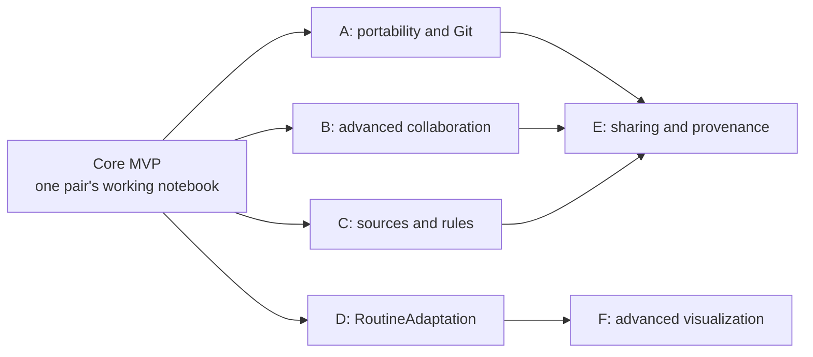
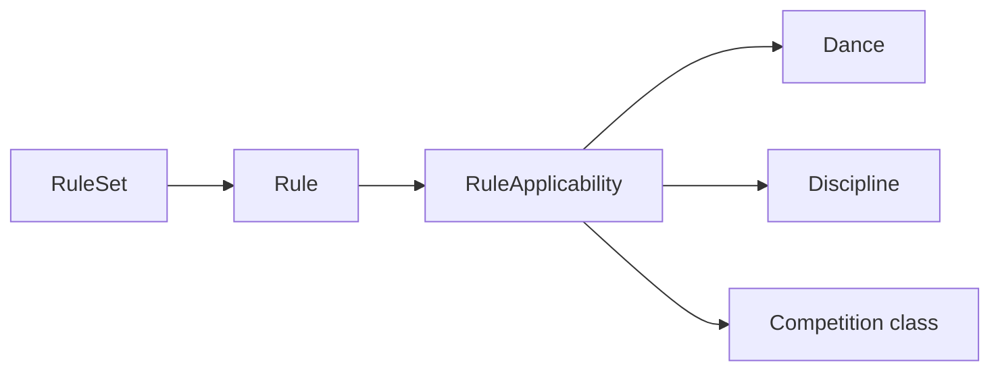

# Future roadmap

This document keeps later architecture visible without turning it into Core-MVP requirements. Nothing here should delay the first usable release defined in [CORE_MVP.md](CORE_MVP.md). Every increment begins only after the pair has real usage evidence and the preceding data migrations/backups are proven safe.

The diagram shows likely dependencies, not a mandatory delivery schedule. Product evidence may reorder independent increments.

## Increment A — data portability and Git versioning

Goal: make dance knowledge portable, reviewable, and intentionally versioned without replacing SQLite as the live editor database.

Candidate scope:

- deterministic JSON and human-readable Markdown export;
- a separate dance-data Git repository under the reserved data boundary;
- explicit “Save Version” commits and “Finished Version” tags;
- history UI and semantic diff;
- safe behavior when the Git working tree was externally modified;
- import with validation and stable-ID handling;
- selective self-contained export/import packages;
- foundations for later three-way merge.

Prerequisites:

- stable Core schema and export contract;
- real backup/restore already trusted;
- canonical versus derived data fully classified;
- migration/version metadata included in export.

Git must not become the Core-MVP backup mechanism or database write path. The SQLite working database remains authoritative until a separately reviewed architecture says otherwise.

## Increment B — advanced collaboration

Goal: move beyond advisory presence when concurrent editing becomes a real source of conflict.

Candidate scope:

- object revisions;
- optimistic concurrency;
- conflict detection and semantic resolution;
- merge-aware autosave;
- persistent session history;
- conflict-aware persistent Undo/Redo.

The design must account for central FigureVariant edits affecting many references and must not introduce hard locks as the default. This increment requires observed conflict cases; it should not speculate about large-team collaboration for a two-person product.

## Increment C — sources and official rules

Goal: connect entered knowledge to durable source material and optionally validate against explicit versioned rules.

Candidate source pipeline:

- original PDF/other document storage;
- derived Markdown where appropriate;
- stable citation anchors;
- structured citations from technical values and Notes;
- document/version comparison.

Candidate rule model:

A Rule may apply to a Dance, discipline, competition class, or a needed combination. ČSTS/WDSF validation and rule-version comparison are possible consumers. No rule or classification is invented before real authoritative source material is entered.

Current lightweight SourceReference values migrate into this model without being retrospectively treated as verified citations.

## Increment D — RoutineAdaptation

Goal: preserve a nominal Routine while adapting it to another Floor or context.

Candidate scope:

- explicit `RoutineAdaptation` referencing a source Routine and target Floor;
- floor-specific placement or geometry adjustments kept outside RoutineFigure's central technical definition;
- comparison with the nominal chained routine;
- later assisted or automatic optimization.

This must not be implemented as generic RoutineFigure technical overrides. The adaptation aggregate owns floor-specific differences and preserves the central FigureVariant.

## Increment E — sharing, import provenance, and clubs

Goal: share knowledge safely between owners after portable identities and conflict behavior are established.

Candidate scope:

- authenticated users and multiple pairs;
- clubs and shared club libraries;
- real read-only guest access;
- owner/origin/provenance metadata for imported objects;
- upstream update notification;
- local modifications versus upstream changes;
- three-way merge;
- permissions and tenant separation.

This increment requires a deliberate ownership migration from the one-Pair database. Core entities should not receive speculative tenant columns beforehand. Imported data must preserve stable local references and expose provenance rather than silently replacing pair-owned knowledge.

## Increment F — advanced visualization

Goal: add richer editing and visualization after the 2D numeric/form workflow proves its domain semantics.

Candidate scope:

- direct graphical trajectory editing;
- Bézier and spline segments;
- richer orientation/body-part geometry;
- 3D viewer;
- physical BodyModel and dancer dimensions;
- character animation and time playback.

The increment preserves these Core distinctions:

- Figure geometry remains local and frame-declared;
- CoupleCenter is not physical centre of mass;
- translation, CoupleRotation, DancerFrame, and head direction remain separate;
- semantic Rise & Fall, Sway, and Hip/Body Action do not become geometry merely because a 3D view exists.

## Other deferred capabilities

- offline mobile editing and synchronization;
- irregular floors, obstacles, columns, or zones;
- sophisticated training tempo maps;
- a full custom technical section/field designer;
- automatic motion generation from dance terminology;
- comprehensive official figure preload, if licensing and provenance ever support it.

## Increment entry criteria

Before promoting a roadmap item into an implementation task:

1. document the concrete pair problem and evidence;
2. state why the Core model cannot solve it already;
3. define data ownership and migration from real databases;
4. identify backup/rollback and compatibility risks;
5. update the authoritative domain/architecture documents;
6. add acceptance scenarios that do not weaken existing invariants;
7. confirm that unrelated future infrastructure remains out of scope.

This gate prevents the roadmap from becoming speculative architecture by accumulation.
