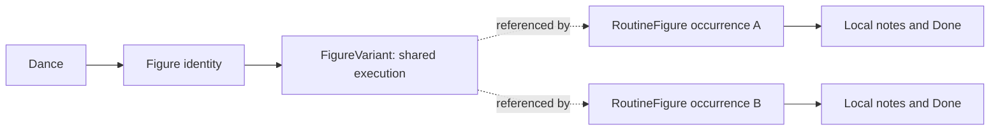

# Product and domain vision

This document is authoritative for what MyDanceBook is, whom it serves, and how Core MVP is separated from later ambitions. Release requirements live in [CORE_MVP.md](CORE_MVP.md); entity semantics live in [DATA_MODEL.md](DATA_MODEL.md).

## Product promise

MyDanceBook gives one competitive dance pair a shared place to capture the routines they actually dance and refine their knowledge during training. It starts as a fast textual notebook and grows, object by object, into structured timing, technique, movement, and floor geometry.

The product is not intended to begin as an official syllabus, a club platform, or a generic dance-theory database. Its first proof of value is that one pair can use it with real data sooner than they could use a more speculative platform.

## Product principles

### One pair first

Core MVP contains exactly one explicit `Pair` with two members:

- one Leader;
- one Follower.

The two members edit the same dance knowledge. Host is a third selectable UI profile, but only a read-only presentation mode—not an account, role, or security boundary. Core MVP has no login, private objects, tenant isolation, clubs, or pair selector.

### Create now, refine later

Unknown information must not prevent useful work. These are all valid states:

- a Routine with only a dance and a name;
- a RoutineFigure placeholder with no selected figure;
- a Figure with only its dance and name;
- an almost-empty first FigureVariant;
- a Movement or GlossaryTerm with only a name;
- a TimingPattern with readable dance notation but no exact rational subdivision;
- EntryState, ExitState, timing, or geometry that is only partly known.

The UI signals incomplete or unverifiable information without treating it as invalid. Only an operation that requires missing information—for example exact phase calculation without exact duration—returns “cannot yet evaluate.” The user can keep editing the routine.

### Central knowledge plus concrete context

Reusable knowledge and its use in choreography have different ownership:

Editing a FigureVariant changes the shared definition everywhere it is referenced. A RoutineFigure owns order, optional section, manual Done status, local notes, and placement context; it does not own a copied variant or a generic technical override.

When one occurrence needs structurally different execution, the user duplicates the current variant, the occurrence switches to the duplicate, and both variants then evolve independently. Genealogy is not retained in Core MVP.

## Supported dance domain

MyDanceBook starts with the ten competitive dances grouped by discipline:

| Standard | Latin |
| --- | --- |
| Waltz | Samba |
| Tango | Cha-Cha-Cha |
| Viennese Waltz | Rumba |
| Slow Foxtrot | Paso Doble |
| Quickstep | Jive |

The navigation also exposes Standard Etudes and Latin Etudes. An Etude is a separate cyclic training or warm-up construction:

- a Standard Etude may use figures from any Standard dance;
- a Latin Etude may use figures from any Latin dance;
- an Etude never mixes the disciplines;
- each figure retains its source Dance identity;
- Etudes use the same Figure and FigureVariant library and may start with placeholders.

Etudes are not eleventh and twelfth dances, and Core MVP does not create a special Etude-element knowledge library.

Core MVP does not preload a complete WDSF or ČSTS figure catalogue. The pair creates the data it actually uses. Small system vocabulary for common notation is useful, but it is explicitly incomplete and extensible.

## Core work objects

### Figure and FigureVariant

A Figure is the named identity of a figure within one Dance. “Natural Turn” in Waltz and an identically named figure in Quickstep are distinct identities.

Creating a Figure requires only its name when the current Dance is already known. It automatically creates a first FigureVariant. A FigureVariant represents one reusable execution by the whole couple while keeping couple, Leader, and Follower information separated internally.

Variant names must not slow first capture. A single initial variant may use a generated name; generated ordinal names appear when variants multiply and remain editable.

### Routine and RoutineFigure

A Routine belongs to one Dance and requires only a name. It contains one global ordered sequence of stable RoutineFigure occurrences. An occurrence can progress through:

1. placeholder;
2. selected Figure without a variant;
3. selected FigureVariant.

Its displayed number comes from order, not identity. Inserting an earlier occurrence never changes its stable ID.

A RoutineSection is optional and describes one contiguous range in the global order. It might mean a floor side, a thematic part, or another choreographic grouping, but it is not inherently a physical floor side and never creates a second order.

### Notes

One generic Note concept attaches multiple individual notes to useful domain objects. Notes are shared by both members and retain author and timestamps for context. The UI makes scope visible, especially the difference between shared FigureVariant notes and notes for this occurrence only.

### Progressive technical knowledge

The common data core supports Standard and Latin. Different discipline templates decide which technical sections are prominent; they do not impose hard dance-theory restrictions.

The model gives stable, frequently used concepts a structured representation while retaining extensible parameters for specialized details. In particular:

- a Step is a first-class Leader or Follower action;
- a TechnicalAction is tied to a concrete Step;
- a MovementEvent is a timed use of reusable Movement knowledge and can span or exist independently of Steps;
- CouplePosition and Hold/Contact are separate timed state layers;
- dance-semantic layers are never silently replaced by geometric layers.

See [DANCE_TECHNIQUE_MODEL.md](DANCE_TECHNIQUE_MODEL.md) for the complete mapping.

## Training workflow

The fastest path through a training session is:

1. open a Dance and Routine;
2. add placeholders as quickly as the choreography is recalled;
3. replace a placeholder by selecting or creating a Figure inline;
4. keep working in the Routine while editing the shared variant in the detail panel;
5. capture short, correctly scoped notes;
6. mark individual occurrences Done manually;
7. refine steps, movement, timing, and geometry when knowledge and time allow.

Manual Done is occurrence-specific progress, not a claim of theoretical completeness. Optional expected figure count can support a simple “10 / 15” progress display. Any future coverage metric must remain separate and must not claim how much dance the pair “knows.”

## Surfaces and usage context

Notebook/desktop is the primary full editing surface with navigation, routine/floor workspace, and selected-item details visible together. The same browser application is responsive on tablet and phone for browsing, notes, Done status, simple edits, and technique/timing review. Complex editors may use simplified mobile layouts; there is no separate mobile application and Core MVP requires an active backend connection.

Both pair members may use the application simultaneously. Core MVP provides only informational presence, browser-session Undo/Redo, and autosave—not hard locks, semantic merge, persistent Undo, or offline synchronization.

## Scope boundary

| Core MVP | Later increments |
| --- | --- |
| One Pair, Leader/Follower profiles, Host presentation mode | Authentication, multiple pairs, clubs, permissions, real guest access |
| Pair-created Figures, variants, routines, Etudes, shared Notes | Shared club libraries, ownership, import provenance, three-way merge |
| Structured common technique with extensible details | Official RuleSets, WDSF/ČSTS validation, document citation pipeline |
| Rational relative timing and derived routine phase where possible | Advanced timing tools and rule-driven validation |
| Numeric/form geometry and interactive 2D SVG floor | Mouse trajectory drawing, splines, 3D, animation, body dimensions |
| SQLite autosave and transactionally consistent backup/restore | Git export, Git history, tags, semantic diff and merge |
| Informational presence and session Undo/Redo | Advanced concurrency, semantic conflict resolution, persistent Undo |
| One nominal floor and derived chaining | RoutineAdaptation and automatic floor optimization |

The detailed release contract is [CORE_MVP.md](CORE_MVP.md). Future capabilities are ordered separately in [FUTURE_ROADMAP.md](FUTURE_ROADMAP.md).

## Product success for the first release

Core MVP succeeds when the pair willingly uses it for real routines and training notes before all technical data is complete. Success is demonstrated by fast capture, safe refinement, understandable shared/local scope, useful phone access, and confidence that SQLite data can be migrated and backed up without loss—not by the breadth of future-platform infrastructure.
