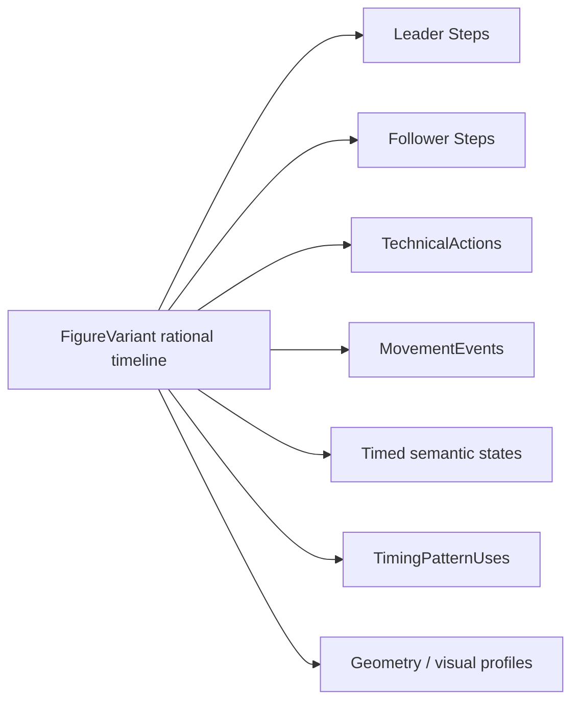
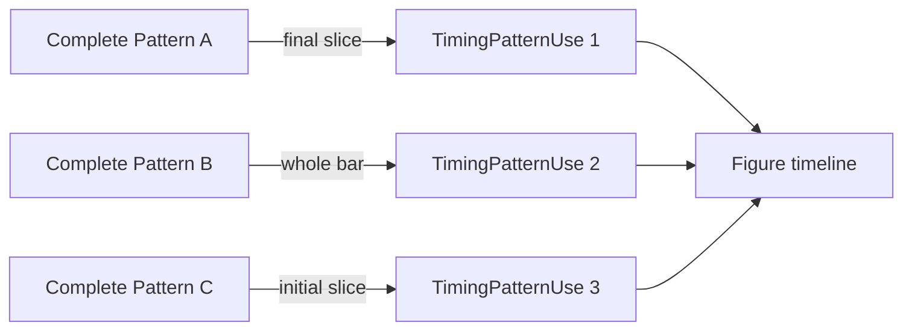
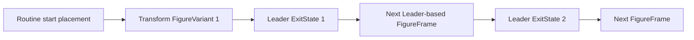

# Timing and geometry semantics

This document is authoritative for temporal truth, musical placement, coordinate frames, trajectory meaning, and derived routine geometry. Entity ownership is defined in [DATA_MODEL.md](DATA_MODEL.md); dance-semantic interpretation is defined in [DANCE_TECHNIQUE_MODEL.md](DANCE_TECHNIQUE_MODEL.md).

## Timing

### One exact Figure timeline

Every FigureVariant has one relative timeline. Its origin is `t = 0` at the variant boundary. The variant may optionally select one TimingScheme; only then can positions and durations be canonical exact rational values. Leader Steps, Follower Steps, TechnicalActions, MovementEvents, timed semantic states, TimingPatternUses, trajectory samples, and VerticalProfile points all refer to this same timeline and inherit that one Scheme context.

There is no separate Leader clock, Follower clock, technique clock, or geometry clock. Independent dancer sequences can overlap and have different counts because they place different objects on the common axis.



Time values are normalized integer fractions `(numerator, denominator)` with a positive denominator. A value counts the musical beat unit defined by the FigureVariant's TimingScheme:

- `1/1` means one Scheme beat unit;
- `3/2` means one and one-half Scheme beat units;
- `0/1` means known zero.

Canonical calculations use rational arithmetic. Decimal values may be display conveniences only; writing `0.333333` must not silently replace canonical `1/3`.

Unknown exact time is `null`/absent, not zero. An event may have known order or natural notation while exact start or duration remains unknown. A variant without a TimingScheme is valid, but all canonical exact timeline fields, including exact duration, are absent. See [ADR 0001](adr/0001-canonical-rational-time.md).

### TimingScheme

TimingScheme provides reusable musical context:

- a defined musical beat unit used by every RationalTime in its context;
- exact `barLength` in those beat units;
- meter and count metadata when known;
- notation conventions and labels;
- optional nominal tempo and tempo unit.

For example, a fictional Scheme whose bar contains three of its defined beats has `barLength = 3/1`. This is an example of representation, not an official claim about a Dance.

A Scheme can be associated with one or more Dances or an Etude. The association is a convenient default, not a permanent one-to-one rule. Training tempo changes and sophisticated tempo maps are later work.

FigureVariant owns optional `timingSchemeId`. Choosing the first Pattern may explicitly assign its Scheme to an unschemed variant as one user-confirmed command. Natural notation never infers the Scheme. Changing Scheme after exact values exist requires an explicit reviewed conversion or removal/re-entry; relabelling the same fractions is forbidden.

### TimingPattern is always a complete bar

TimingPattern represents one complete bar in a TimingScheme, even when its exact subdivision has not been entered. It has readable natural notation such as fictional examples `S Q Q` or `1 & 2 3` and may later gain exact rational offsets/durations.

The glyph `&` has no universal duration. Meaning comes only from the concrete Pattern and Scheme. The application must not infer a fixed value from notation alone.

Pattern exactness states:

| State | Meaning | Allowed behavior |
| --- | --- | --- |
| `INCOMPLETE` | Natural notation exists, exact full-bar subdivision does not | Select and display; exact calculations return cannot evaluate |
| `EXACT_UNVALIDATED` | Rational subdivision exists but has not passed all internal checks | Use provisionally and show review state |
| `EXACT_VALIDATED` | Subdivision is internally consistent with the complete bar | Use for exact calculations |

“Validated” means internal consistency only, never official WDSF/ČSTS correctness.

### TimingPatternUse and partial bars

TimingPatternUse maps a slice of a complete Pattern into a FigureVariant:

- `figureStart`: exact position of the slice on the Figure timeline;
- `patternStart`: exact offset within the complete bar;
- `usedDuration`: exact length exposed by this use.

The Pattern and FigureVariant must reference the same TimingScheme for every use, including notation-only/incomplete use. For exact mapping, Pattern-local `p`, `patternStart`, `usedDuration`, and Figure-local `figureStart` all count the same beat unit.

For a Pattern with full-bar length `B`, a valid exact slice satisfies:

```text
0 <= patternStart < B
0 < usedDuration <= B - patternStart
```

A Pattern-local event at `p` inside the used slice maps to Figure time:

```text
tFigure = figureStart + (p - patternStart)
```

This is a unit-preserving rational translation. Assigning a Pattern from another Scheme is refused without changing the variant. If incompatible data arrives through import/legacy storage, preserve it as `REQUIRES_REVIEW` and exclude it from exact calculations until explicitly resolved.

The first and final TimingPatternUse may be partial; intermediate uses are normally complete bars. A Figure beginning on counts 2–3 of a bar points to the appropriate slice of a complete Pattern. It never creates a misleading “2 3” partial-bar Pattern.

Uses can be recorded in order with readable slice intent before all three exact values are known. Gaps, overlaps, or disagreement with variant duration produce a non-blocking consistency result rather than destructive normalization.



Figure boundaries therefore do not imply bar boundaries.

### Variant duration and relative timing

FigureVariant owns optional `timingSchemeId`, relative exact `duration`, and optional `entryTimingConstraint`. Exact duration and the constraint are absent without a Scheme. The constraint is the single editable source describing a permitted or preferred musical phase in that Scheme; EntryState stores no copy. It is not the variant's actual phase in a Routine.

Exact variant duration may be:

- derived from complete exact timed coverage when unambiguous;
- explicitly entered as an exact duration with entered provenance;
- unavailable while timing remains incomplete.

If entered duration and a derivable candidate disagree, keep both and report `REQUIRES_REVIEW`. Do not resize events or overwrite the entered value.

### Routine musical placement

Routine may contain one optional `musicalStartAnchor`, containing a TimingScheme and an exact rational phase such as “count 1.” Without it, the routine remains fully editable but absolute musical phases cannot be derived.

For compatible exact timing, occurrence start phase is derived recursively:

```text
phase(occurrence 1) = musicalStartAnchor
phase(occurrence i + 1) = phase(occurrence i) + duration(variant i)
```

Phase is reduced modulo the anchor Scheme's `barLength` only for display and constraint comparison; the accumulated rational routine time can remain unbounded. Placeholders, missing variants, unschemed variants, unknown duration, or a variant Scheme incompatible with the anchor stop exact derivation at that boundary. Later occurrences remain editable and show `CANNOT_YET_VERIFY`.

There is no manually maintained `RoutineFigure.startPhase` sequence. A cache of derived phase, if used, is disposable and versioned against its inputs.

An occurrence whose derived phase conflicts with its FigureVariant `entryTimingConstraint` is marked `REQUIRES_REVIEW`. The system does not shift the music, insert time, alter the variant, or create a local timing override.

### Timing consistency results

Core-MVP checks include:

- exact Pattern subdivisions fit one complete bar;
- exact PatternUse slices fit the Pattern;
- mapped uses do not unintentionally overlap or leave unexplained gaps;
- known event ranges fit known variant duration;
- entered and derived duration agree;
- routine phase can be propagated through each boundary;
- derived entry phase satisfies an entryTimingConstraint;
- every exact value has one variant Scheme and every exact PatternUse matches it.

Use these outcomes:

- `OK`: available exact inputs are coherent;
- `REQUIRES_REVIEW`: enough information exists to show a contradiction;
- `CANNOT_YET_VERIFY`: inputs are absent, incomplete, or use incompatible context.

Checks do not claim official technique validity and do not block ordinary capture.

## Geometry

### Units and canonical layers

Every created Floor has name, positive width, and positive length; its dimensions and placement use metres. A Routine can have no Floor. Figure geometry is authored in local abstract Step Units (`SU`). `1 SU` means a normal step scale for authoring; it is not a physical constant and Core MVP does not require body calibration.

An optional Pair/DanceSettings `metersPerSU` maps local geometry to a Floor. If it is absent, the UI may use a clearly labelled assumed visualization scale so the pair can still see relative choreography. In that state, metre placement and overflow are approximate and must not be presented as measured truth. Entering calibration later changes derived floor rendering, not authored SU coordinates.

VerticalProfile is dimensionless and separate from both metre Z and SU.

### FloorFrame

Core-MVP Floor is a rectangle in the XY plane. Its internal mathematical frame is:

- origin: bottom-left corner;
- `+X`: right;
- `+Y`: up across the floor plane;
- `+Z`: vertically upward;
- planar `0°`: `+X`;
- planar `90°`: `+Y`;
- positive angle: counter-clockwise.

User-facing controls prefer dance terminology such as Line of Dance where meaningful. Semantic Alignment/Direction remains separate from these angles.

### FigureFrame

Each FigureVariant owns geometry in one fixed local FigureFrame established at its start:

- origin: Leader center;
- `+Y`: Leader forward/chest direction at entry;
- `+X`: right from Leader perspective;
- `+Z`: up.

FigureFrame does not rotate with the dancer during the Figure. The Leader, Follower, and CoupleCenter trajectories all use this shared fixed local frame, which makes their relative data comparable.

Given a Routine placement with Leader-forward Floor angle `theta`, define Floor unit vectors:

```text
forward = (cos(theta), sin(theta))
right   = (sin(theta), -cos(theta))
```

For local point `(xSU, ySU)` and scale `s = metersPerSU`, the derived Floor point is:

```text
pFloor = figureOrigin + s * xSU * right + s * ySU * forward
```

This formula documents axis meaning, not a requirement to store transformed copies.

### Entry and Exit geometry

EntryState may contain Follower position/orientation relative to Leader/FigureFrame plus concise semantic, foot, weight, and selected body boundary state. Leader entry center is exactly FigureFrame origin and Leader entry forward is exactly `+Y`; neither is stored as ordinary independent EntryState geometry. EntryState also contains no editable timing constraint.

ExitState may contain Leader exit center/orientation in FigureFrame, Follower exit relation, and concise boundary state. Exit Leader center/orientation is the key input to Routine chaining.

Manual and derived boundary components coexist with provenance where derivation is meaningful. If detailed trajectory end or DancerFrame implies a different Exit value than the entered snapshot, neither overwrites the other. The frame-defined Leader entry pose has no competing entered/derived copies. See [ADR 0002](adr/0002-boundary-state-semantics.md).

### Routine geometric chaining

Routine stores only optional start placement and orientation, not independent X/Y/rotation for every RoutineFigure.



For each occurrence:

1. transform the central variant's local FigureFrame into the current Floor placement;
2. render all known trajectories and orientations through that transform;
3. transform Leader Exit center and forward orientation;
4. use them as origin and `+Y` direction of the next FigureFrame;
5. continue.

Central edits can therefore change derived placement of all following occurrences. That is expected and must be communicated; it is not a reason to copy geometry locally.

If an occurrence is a placeholder, has no variant, or lacks enough Leader exit geometry, absolute chaining stops. The UI renders the known prefix, marks the first unresolved boundary, and leaves the rest of the Routine usable. A later Core-MVP occurrence does not receive an ad hoc manual placement override to bypass the gap.

For a cyclic Routine/Etude, the final derived exit may be compared with initial entry as a non-blocking closure check when enough data exists.

### CoupleCenter and TravelFrame

CoupleCenter is a deliberately authored visual/choreographic point. It is not a physical centre of mass and is not automatically averaged from Leader/Follower paths.

TravelFrame is derived from the instantaneous tangent of CoupleCenter:

- forward axis follows the non-zero tangent;
- when instantaneous velocity is zero, retain the last valid direction;
- if no previous valid direction exists, TravelFrame is unknown;
- on-the-spot rotation is represented by CoupleRotation, not fabricated tangent motion.

TravelFrame describes direction of travel, not either dancer's chest direction.

### DancerFrame

Leader and Follower may each have a time-varying DancerFrame centered on that dancer. Its forward axis represents body/chest orientation and is independent from path tangent and TravelFrame. UI input should use semantic directions and friendly rotation controls rather than raw Euler-angle editing.

Head/gaze orientation is separate body-part information. DancerFrame chest direction must not be reused as head direction.

### CoupleRotation

CoupleRotation is a timed geometric layer, initially rotation about vertical Z around CoupleCenter. It is independent from CoupleCenter translation:

- a curved path does not canonically imply CoupleRotation;
- CoupleRotation may occur on the spot with zero CoupleCenter velocity;
- a suggested rotation derived from other geometry has derived provenance and cannot replace entered rotation silently.

### Trajectories and segments

Three trajectories can be authored independently per FigureVariant:

- CoupleCenter;
- Leader;
- Follower.

Core segment kinds are structured numeric/form data:

- `STRAIGHT`: start/end or displacement in FigureFrame;
- `ARC`: start, centre/radius or equivalent stable parameters, and signed sweep;
- `LOOP`: explicit closed/looping segment parameters suitable for its simple Core renderer.

The exact SQL parameterization for arc and loop must be fixed and tested during schema/API design; every stored segment declares kind, frame, SU units, order, and optional rational time anchors. Advanced Bézier/spline control points and direct mouse drawing are later increments.

The independent paths may disagree. Core MVP reports visible inconsistencies but never regenerates one canonical path from another.

### SVG visual semantics

The floor visualization uses:

- solid gray for CoupleCenter;
- dotted/dashed configurable Leader color (default light blue);
- dotted/dashed configurable Follower color (default light raspberry/red);
- numbered circle N at the start of Figure N;
- path from marker N toward marker N+1 as Figure N's geometry;
- explicit selection and visible floor overflow.

An arrow tip on an individual dancer trajectory indicates only forward versus backward travel relative to its tangent. It says nothing about chest, shoulders, or gaze.

A short shoulder-axis line and triangle, when orientation data exists, show chest/front direction only. They do not show head/gaze. Figure-start markers are prominent; optional Step-start markers are visually secondary.

### VerticalProfile

VerticalProfile is a continuous relative visual curve over rational Figure time. Values may use reference anchors `-2` through `+2` but are not limited to integers. Transition semantics are `CONTINUOUS`, `HOLD`, `SHARP`, or `UNSPECIFIED`.

One shared curve can render gray. Separate Leader/Follower curves use dancer colors. Rendering interpolation is a view concern and cannot invent canonical intermediate technique.

VerticalProfile is not:

- technical Rise & Fall;
- dancer height in metres or SU;
- automatically derived from foot/knee data.

### Geometry consistency results

Core checks may establish:

- whether a variant has enough Leader exit data to chain;
- whether Follower entry relation and predecessor exit relation clearly conflict;
- whether entered/derived boundary geometry agrees;
- whether an exact SU-to-metre scale is present or only assumed;
- whether derived paths overflow the selected rectangle;
- whether required trajectory references are broken.

Overflow is information, not invalid choreography. Missing geometry yields `CANNOT_YET_VERIFY`; a clear entered/derived contradiction yields `REQUIRES_REVIEW`.

## Explicit non-goals for Core semantics

- no normalized-floor coordinate authoring as the primary geometry;
- no per-occurrence geometry copies or automatic floor adaptation;
- no inference that semantic Alignment equals a mathematical angle;
- no inference that Rise & Fall equals VerticalProfile, Sway equals inclination, or Hip/Body Action equals pelvis motion;
- no physical centre-of-mass calculation;
- no irregular floors, obstacles, advanced splines, 3D frames, body dimensions, or character animation;
- no official dance-rule validation.
