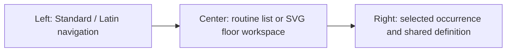

# Interaction and responsive UX

This document is authoritative for how people interact with MyDanceBook. It uses English conceptual labels so implementation identifiers remain unambiguous; shipped user-facing text is Czech.

## UX principles

- Optimize for capture during training: preserve context, minimize required fields, and keep frequent actions near the Routine.
- Reveal detail progressively. Empty technical sections are opportunities, not errors.
- Make shared versus local scope visible before a change is made.
- Use non-blocking review states for incomplete or contradictory information.
- Prefer direct editing for the two trusted pair members; Host remains a simple presentation surface.
- Preserve stable selection and scroll context after autosave, reordering, inline creation, and variant duplication.

## Desktop: three working regions

Notebook/desktop is the full editing environment.



The left region contains the discipline tree, its dances and Etudes, Routines under the selected Dance, and quick creation. The center region switches between the ordered routine notebook and floor visualization without losing the selected occurrence. The right region is a contextual inspector/editor.

Panels may be resized or collapsed, but shared/local information must not be hidden behind ambiguous tabs whose state is easy to miss.

## Tablet and phone

The product remains one responsive web application.

| Width/context | Navigation | Routine/floor | Detail editing |
| --- | --- | --- | --- |
| Notebook/desktop | Persistent left panel | Persistent center | Persistent right panel |
| Tablet | Drawer or compact rail | Primary surface | Side sheet or adjacent pane where space permits |
| Phone | Full-screen drawer | Full-screen list/floor mode | Full-screen detail route/sheet with clear Back |

Phone Core-MVP flows include browsing, adding a Note, simple text or selection edits, and reviewing timing/technique. Complex numeric trajectory or dense timeline editors may use simplified forms and horizontal subviews. Selection, unsaved edit state, and Back behavior must remain predictable.

There is no offline mode. Loss of backend connection is shown explicitly; the UI must not pretend an unsaved change was persisted.

## First run and profile switcher

First run presents only two required inputs: Leader display name and Follower display name. Discipline preferences, floor, colors, and technical settings can be configured later.

The global switcher contains:

- Leader display name;
- Follower display name;
- Host.

Switching member changes active-author context and presence identity, not access to data. A small persistent indicator prevents a member from unknowingly authoring notes as the other member.

Host mode:

- renders normal shared data and routine/floor presentation;
- removes or disables mutation controls consistently;
- cannot be described as secure guest access;
- offers an obvious way back to a member profile.

## Main navigation

The conceptual tree is:

```text
STANDARD                         LATIN
  Waltz                            Samba
  Tango                            Cha-Cha-Cha
  Viennese Waltz                   Rumba
  Slow Foxtrot                     Paso Doble
  Quickstep                        Jive
  Etudes                           Etudes
```

Etudes have a distinct visual type label so they are never mistaken for a Dance. A Figure chosen for an Etude displays its source Dance.

Archived objects are excluded from normal creation selectors by default, with an explicit “show archived” path where restoration or existing-reference inspection is needed.

## Quick Routine entry

Creating a Routine asks only for Dance and name and immediately shows its automatically created first Section, `Část 1`. The heading is always visible, including while it is the only Section, so Leader or Follower can rename it directly without a second creation dialog. Host sees the same hierarchy without mutation controls.

Each Section has its own primary `+ Figure` command. It opens a keyboard- and touch-friendly chooser with four paths:

1. add a placeholder immediately;
2. search a Figure for the current Dance;
3. select one of that Figure's variants;
4. create a missing Figure inline.

Inline creation asks only for name because the Routine supplies Dance. Submission atomically creates the Figure and first variant, assigns it, closes the chooser, and selects the new occurrence. The Routine remains visible throughout.

Sections use free user-entered names and accessible up/down commands. Empty Sections are normal, and creating another Section asks only for its name and appends it. Names such as long side, short side, or corner carry no built-in semantics.

The ordered list supports insert before/after, drag or accessible move commands, and removal with clear consequences. Occurrences reorder within their current Section. A focused `Routine section` control moves an occurrence to another Section while preserving its stable identity and contextual data. Occurrence numbers update by flattening ordered Sections and each Section's local order; no global display number is stored.

Placeholders show neutral labels such as “Figure 3 — not selected yet,” belong to the Section where they were added, and accept notes. They are not error-red.

## Shared definition versus this occurrence

The right detail surface always displays scope before fields:

```text
┌ Shared definition ───────────────────────────────────┐
│ Changes apply everywhere this variant is used        │
│ Figure identity, variant, timing, steps, technique…  │
└───────────────────────────────────────────────────────┘

┌ This occurrence in the routine ──────────────────────┐
│ Only this stable occurrence                          │
│ Local notes, section and placement context           │
└───────────────────────────────────────────────────────┘
```

The two scopes use more than color alone: distinct headings, explanatory text, grouping borders, and scope badges. Central editing is direct for Leader/Follower; no unlock click is required.

If multiple occurrences use the selected variant, the shared area may display “Used in N occurrences” with navigation. This informs rather than blocks editing.

## Creating another variant

“Create new variant from this variant” appears near the shared variant selector when an occurrence is selected. Confirmation states that:

- a new independent shared variant will be created;
- this occurrence will switch to it;
- other occurrences will keep the original.

After the atomic operation, the new variant is selected and editable. The UI does not expose a generic “override here” escape hatch. Local advice continues to use Notes.

## Notes UX

Every Note composer displays its target scope in its heading and submit action, for example:

- “Add shared note to this FigureVariant”;
- “Add note only to this routine occurrence.”

Notes are separate chronological items with author and timestamps, not one large shared text area. Editing retains original author and updates `updatedAt`; the UI may show “edited.” Switching scope means creating/moving through an explicit action, never silently changing the target.

On small screens, the target badge stays visible while composing. Host sees notes but no composer.

## View and Edit behavior

Leader and Follower can enter edit mode at the section or field level. The interface should avoid a global page mode that makes the scope unclear. Recommended behavior:

- short scalar/text fields save on explicit commit or blur when validation is local;
- complex groups use Apply/Cancel within that group;
- autosave status communicates `saving`, `saved`, `offline/not saved`, and `requires review` separately;
- incomplete optional fields can be cleared without validation theatrics;
- calculations that lack exact inputs show “Cannot yet evaluate” and link to the missing section.

Undo/Redo belongs to the current browser session. Its label should name the action where practical. An Undo of `A → B` may apply `B → A` only while the relevant current value is still B. If another save changed it, the item becomes unavailable and the UI explains that it cannot be safely undone because the value changed. It never overwrites the newer value, does not undo another device's work, and must not imply persistent history.

## Technical sections

The baseline configurable catalogue is:

- Timing;
- Trajectory;
- Steps / feet;
- Body;
- Rise & Fall;
- Vertical movement;
- Sway / inclination;
- Head;
- Arms;
- Technique;
- Notes.

Standard and Latin templates provide different default visibility and order only. The pair can show/hide and reorder predefined sections. Core MVP does not provide arbitrary custom section or field construction.

Each section can summarize completeness with neutral states such as empty, partial, exact, or review needed.

## Timing interaction

The notebook may capture `FigureVariant.timingNotation` as a clearly labelled shared-definition field (“Doby / timing”). It is optional readable shorthand, not an exact editor; it is shown compactly on referencing routine rows where space permits. A row title toggles its expanded occurrence context, including for Host, while Host remains unable to mutate the shared definition.

One browser-local Czech/English Figure-name preference applies to normal notebook display, with fallback to the available translation and then the first shared alias. Compact RoutineFigure rows show the preferred name first and the distinct other translation as secondary information; aliases do not clutter normal rows. The shared-definition panel owns names and aliases, while the Dance-scoped selector can filter names and aliases. It never changes the Czech application UI or the shared bilingual Figure editor. The generated default variant remains structurally selected where referenced but its label is omitted from compact rows; a scoped variant selector appears only when there is a meaningful choice. The routine controls select references or explicitly create a new Figure; editing an existing Figure's names belongs only to the shared-definition panel.

Natural notation is accepted before exact subdivisions. An incomplete TimingPattern shows its readable notation and an “Exact timing not entered” badge. It remains selectable.

The timing editor always shows the FigureVariant's TimingScheme when exact values are present. If the variant has none, selecting a Pattern explicitly offers to assign that Pattern's Scheme; notation alone never selects one. A Pattern from another Scheme cannot be silently attached or converted.

When exact rational values are edited, the UI should offer numerator/denominator or dance-friendly subdivision controls, label that values count Scheme beat units, and render a readable preview such as “3/2 = 1½ beats.” It must not convert canonical values to rounded floating-point values.

TimingPatternUse visually indicates a complete pattern plus any clipped first/final interval. A figure beginning mid-bar shows a partial use of a full-bar pattern, not a newly invented partial pattern.

Routine actual phase is displayed as derived when available. A conflict with `entryTimingConstraint` is a review card, not an automatic shift or blocker.

EntryState may show the variant's entry timing constraint for context, but it does not offer another editable copy.

## Floor creation

Creating a Floor asks for exactly the concrete rectangle information needed by the model: name, positive width in metres, and positive length in metres. A Routine never forces this flow and can keep “No floor selected” indefinitely. The UX does not create a dimensionless placeholder Floor.

## Floor SVG interaction and conventions

The center floor view supports selection, pan/zoom as needed, and switching between overview and selected figure. Core MVP geometry input is numeric/form-based; SVG is not required to be a drawing editor.

Rendering conventions:

- Floor: rectangular boundary in metre scale;
- CoupleCenter: solid gray trajectory;
- Leader: dotted/dashed light-blue trajectory by default;
- Follower: dotted/dashed light raspberry/red trajectory by default;
- numbered circle N: start of Figure N;
- segment from marker N toward N+1: owned by Figure N;
- overflow beyond Floor: visible and highlighted, never clipped silently;
- selected Figure: emphasized without hiding the other paths.

A small arrowhead on an individual dancer path shows only forward versus backward movement relative to the path tangent. It never shows chest, shoulders, head, or gaze.

When known, a short shoulder-axis line plus triangle shows chest/front direction. It never shows head/gaze. Figure-start markers are prominent; optional Step-start markers are thinner.

If chaining becomes impossible after an incomplete variant, the known geometry remains visible and the first unresolved boundary is marked “Further placement cannot yet be derived.”

## Presence and simultaneous use

When another member appears to be editing the same object, show an informational banner such as “Zuzanna is currently editing this Figure.” Minimal presence tracks session ID, active member/profile, object type/ID, and last-seen time using heartbeat/polling. It expires after a short inactive/disconnected interval, is harmless to lose on restart, carries no authentication meaning, and never hard-locks fields.

Core MVP may use last-write behavior for simultaneous normal saves to the same simple field, but autosave sends bounded commands rather than stale whole-variant snapshots and the UI must surface save failures rather than claiming success. Presence reduces likely overlap, and the expected-value Undo check prevents a later value from being blindly reverted. Object revisions, optimistic concurrency, and semantic conflict resolution belong to the roadmap.

## Internal consistency feedback

Use three non-blocking result classes consistently:

| State | Meaning | UX response |
| --- | --- | --- |
| `OK` | Available data is internally coherent | Quiet success or compact check |
| `REQUIRES REVIEW` | Entered/derived data conflict or a broken invariant is visible | Persistent warning with both values and a route to review |
| `CANNOT YET VERIFY` | Required information is absent or timing is incomplete | Neutral incomplete state; continue editing |

The UI never silently replaces explicitly entered data with a derived value.

## Backup and restore UX

“Create database backup” reports progress, completion time, and the resulting snapshot identity. It must not describe a raw file copy as safe.

This polished user workflow is completed in Phase 6. A tested internal consistent-snapshot capability already exists from Phase 1 for migration safety and early real data; its lack of a manager UI does not mean backups are unavailable internally.

Restore is an intentionally guarded flow:

1. select a known backup and display its metadata;
2. warn that current working data will be replaced;
3. state that a safety backup will be created first;
4. require explicit confirmation;
5. prevent edits during the short restore operation;
6. report success or leave the current database intact on failure.

## Accessibility and input

- Every drag action has keyboard/button alternatives.
- Scope and validation do not rely on color alone.
- Touch targets fit phone use during training.
- SVG paths and markers have textual selected-item equivalents.
- Focus returns to the logical place after inline creation, modal dismissal, and reordering.
- Czech labels should use established dance terminology, while unexplained abbreviations remain linked to glossary help.
